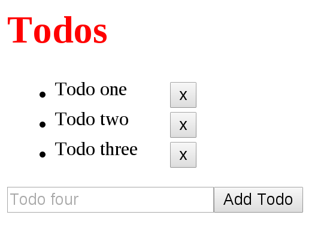

This repo shows you how to test React component. It is loosely based on Jack Franklin's article ["Testing React Applications"](http://12devsofxmas.co.uk/2015/12/day-2-testing-react-applications/).


## Demo

```bash
$ git clone https://github.com/ruanyf/react-testing-demo.git
$ cd react-testing-demo && npm install
$ npm start
$ open http://127.0.0.1:8080
```

Now, you visit http://127.0.0.1:8080/, and should see a Todo app.



There are 5 places to test.

> 1. App's title should be "Todos"
> 1. Initial state of a Todo item should be right ("done" or "undone")
> 1. Click a Todo item, its state should be toggled (from "undone" to "done", or vice versa)
> 1. Click a Delete button, the Todo item should be deleted
> 1. Click the Add Todo button, a new Todo item should be added into the TodoList

All [test cases](https://github.com/ruanyf/react-testing-demo/tree/master/test) have been written. You run `npm test` to find the test result.

```bash
$ npm test
```

## Index

- [Testing Library](#testing-library)
- [React official Test Utilities](#react-official-test-utilities)
  - [Shallow Rendering](#shallow-rendering)
  - [renderIntoDocument](#renderintodocument)
  - [findDOMNode](#finddomnode)
- [Enzyme Library](#enzyme-library)
  - [shallow](#shallow)
  - [render](#render)
  - [mount](#mount)
  - [API List](#api-list)
- [License](#license)

## Testing Library

The most important tool of testing React is [official Test Utilities](https://facebook.github.io/react/docs/test-utils.html), but it only provides low-level API. As a result, some third-party test libraries are built based on it. Airbnb's [Enzyme library](https://github.com/airbnb/enzyme) is the easiest one to use among them.

Thus every test case has at least two ways to write.

> - Test Utilities' way
> - Enzyme's way

This repo will show you both of them.

## React official Test Utilities

Since a component could be rendered into either a virtual DOM object (`React.Component`'s instance) or a real DOM node, [Test Utilities](https://facebook.github.io/react/docs/test-utils.html) library gives you two testing choices.

> - **Shallow Rendering**: testing a virtual DOM object
> - **DOM Rendering**: testing a real DOM node

### Shallow Rendering

[Shallow Rendering](https://facebook.github.io/react/docs/test-utils.html#shallow-rendering) just renders a component "one level deep" without worrying about the behavior of child components, and returns a virtual DOM object. It does not require a DOM, since the component will not be mounted into DOM.

At first, import the Test Utilities in your test case script.

```javascript
import TestUtils from 'react-addons-test-utils';
```

Then, write a Shallow Rendering function.

```javascript
import TestUtils from 'react-addons-test-utils';

function shallowRender(Component) {
  const renderer = TestUtils.createRenderer();
  renderer.render(<Component/>);
  return renderer.getRenderOutput();
}
```

In the code above, we define a function `shallowRender` to return a component's shallow rendering.

The [first test case](https://github.com/ruanyf/react-testing-demo/blob/master/test/shallow1.test.js) is to test the title of `App`. It needn't interact with DOM and doesn't involve child-components, so is most suitable for use with shadow rendering.

```javascript
describe('Shallow Rendering', function () {
  it('App\'s title should be Todos', function () {
    const app = shallowRender(App);
    expect(app.props.children[0].type).to.equal('h1');
    expect(app.props.children[0].props.children).to.equal('Todos');
  });
});
```

You may feel `app.props.children[0].props.children` intimidating, but it is not. Each virtual DOM object has a `props.children` property which contains its all children components. `app.props.children[0]` is the `h1` element whose `props.children` is the text of `h1`.

The [second test case](https://github.com/ruanyf/react-testing-demo/blob/master/test/shallow2.test.js) is to test the initial state of a `TodoItem` is undone.

At first, we should modify the function `shallowRender` to accept second parameter.

```javascript
import TestUtils from 'react-addons-test-utils';

function shallowRender(Component, props) {
  const renderer = TestUtils.createRenderer();
  renderer.render(<Component {...props}/>);
  return renderer.getRenderOutput();
}
```

The following is the test case.

```javascript
import TodoItem from '../app/components/TodoItem';

describe('Shallow Rendering', function () {
  it('Todo item should not have todo-done class', function () {
    const todoItemData = { id: 0, name: 'Todo one', done: false };
    const todoItem = shallowRender(TodoItem, {todo: todoItemData});
    expect(todoItem.props.children[0].props.className.indexOf('todo-done')).to.equal(-1);
  });
});
```

In the code above, since [`TodoItem`](https://github.com/ruanyf/react-testing-demo/blob/master/app/components/TodoItem.jsx) is a child component of [`App`](https://github.com/ruanyf/react-testing-demo/blob/master/app/components/App.jsx), we have to call `shallowRender` function with `TodoItem`, otherwise it will not be rendered. In our demo, if the state of a `TodoItem` is undone, the `class` property (`props.className`) contains no `todo-done`.

### renderIntoDocument

The second testing choice of official Test Utilities is to render a React component into a real DOM node. `renderIntoDocument` method is used for this purpose.

```javascript
import TestUtils from 'react-addons-test-utils';
import App from '../app/components/App';

const app = TestUtils.renderIntoDocument(<App/>);
```

`renderIntoDocument` method requires a DOM, otherwise throws an error. Before running the test case, DOM environment (includes `window`, `document` and `navigator` Object) should be available. So we use [jsdom](https://github.com/tmpvar/jsdom) to implement the DOM environment.

```javascript
import jsdom from 'jsdom';

if (typeof document === 'undefined') {
  global.document = jsdom.jsdom('<!doctype html><html><body></body></html>');
  global.window = document.defaultView;
  global.navigator = global.window.navigator;
}
```

We save the code above into [`test/setup.js`](https://github.com/ruanyf/react-testing-demo/blob/master/test/setup.js). Then modify `package.json`.

```javascript
{
  "scripts": {
    "test": "mocha --compilers js:babel-core/register --require ./test/setup.js",
  },
}
```

Now every time we run `npm test`, `setup.js` will be required into test script to run together.

The [third test case](https://github.com/ruanyf/react-testing-demo/blob/master/test/dom1.test.js) is to test the delete button.

```javascript
describe('DOM Rendering', function () {
  it('Click the delete button, the Todo item should be deleted', function () {
    const app = TestUtils.renderIntoDocument(<App/>);
    let todoItems = TestUtils.scryRenderedDOMComponentsWithTag(app, 'li');
    let todoLength = todoItems.length;
    let deleteButton = todoItems[0].querySelector('button');
    TestUtils.Simulate.click(deleteButton);
    let todoItemsAfterClick = TestUtils.scryRenderedDOMComponentsWithTag(app, 'li');
    expect(todoItemsAfterClick.length).to.equal(todoLength - 1);
  });
});
```

In the code above, first, `scryRenderedDOMComponentsWithTag` method finds all `li` elements of the `app` component. Next, get out `todoItems[0]` and find the delete button from it. Then use `TestUtils.Simulate.click` to simulate the click action upon it. Last, expect the new number of all `li` elements to be less one than the old number.

Test Utilities provides many methods to find DOM elements from a React component.

> - [scryRenderedDOMComponentsWithClass](https://facebook.github.io/react/docs/test-utils.html#scryrendereddomcomponentswithclass): Finds all instances of components in the rendered tree that are DOM components with the class name matching className.
> - [findRenderedDOMComponentWithClass](https://facebook.github.io/react/docs/test-utils.html#findrendereddomcomponentwithclass): Like scryRenderedDOMComponentsWithClass() but expects there to be one result, and returns that one result, or throws exception if there is any other number of matches besides one.
> - [scryRenderedDOMComponentsWithTag](https://facebook.github.io/react/docs/test-utils.html#scryrendereddomcomponentswithtag): Finds all instances of components in the rendered tree that are DOM components with the tag name matching tagName.
> - [findRenderedDOMComponentWithTag](https://facebook.github.io/react/docs/test-utils.html#findrendereddomcomponentwithtag): Like scryRenderedDOMComponentsWithTag() but expects there to be one result, and returns that one result, or throws exception if there is any other number of matches besides one.
> - [scryRenderedComponentsWithType](https://facebook.github.io/react/docs/test-utils.html#scryrenderedcomponentswithtype): Finds all instances of components with type equal to componentClass.
> - [findRenderedComponentWithType](https://facebook.github.io/react/docs/test-utils.html#findrenderedcomponentwithtype): Same as scryRenderedComponentsWithType() but expects there to be one result and returns that one result, or throws exception if there is any other number of matches besides one.
> - [findAllInRenderedTree](https://facebook.github.io/react/docs/test-utils.html#findallinrenderedtree): Traverse all components in tree and accumulate all components where test(component) is true.

These methods are hard to spell. Luckily, we have another more concise ways to find DOM nodes from a React component.

### findDOMNode

If a React component has been mounted into the DOM, `react-dom` module's `findDOMNode` method returns the corresponding native browser DOM element.

We use it to write the [fourth test case](https://github.com/ruanyf/react-testing-demo/blob/master/test/dom2.test.js). It is to test the toggle behavior when a user clicks the Todo item.

```javascript
import {findDOMNode} from 'react-dom';

describe('DOM Rendering', function (done) {
  it('When click the Todo item，it should become done', function () {
    const app = TestUtils.renderIntoDocument(<App/>);
    const appDOM = findDOMNode(app);
    const todoItem = appDOM.querySelector('li:first-child span');
    let isDone = todoItem.classList.contains('todo-done');
    TestUtils.Simulate.click(todoItem);
    expect(todoItem.classList.contains('todo-done')).to.be.equal(!isDone);
  });
});
```

In the code above, `findDOMNode` method returns `App`'s DOM node. Then we find out the first `li` element in it, and simulate a click action upon it. Last, we expect the `todo-done` class in `todoItem.classList` to toggle.

The [fifth test case](https://github.com/ruanyf/react-testing-demo/blob/master/test/dom3.test.js) is to test adding a new Todo item.

```javascript
describe('DOM Rendering', function (done) {
  it('Add an new Todo item, when click the new todo button', function () {
    const app = TestUtils.renderIntoDocument(<App/>);
    const appDOM = findDOMNode(app);
    let todoItemsLength = appDOM.querySelectorAll('.todo-text').length;
    let addInput = appDOM.querySelector('input');
    addInput.value = 'Todo four';
    let addButton = appDOM.querySelector('.add-todo button');
    TestUtils.Simulate.click(addButton);
    expect(appDOM.querySelectorAll('.todo-text').length).to.be.equal(todoItemsLength + 1);
  });
});
```

In the code above, at first, we find the `input` box and add a value into it. Then, we find the `Add Todo` button and simulate the click action upon it. Last, we expect the new Todo item to be appended into the Todo list.

## Enzyme Library

[Enzyme](https://github.com/airbnb/enzyme) is a wrapper library of official Test Utilities, mimicking jQuery's API to provide an intuitive and flexible way to test React component.

It provides three ways to do the testing.

> - `shallow`
> - `render`
> - `mount`

### shallow

[shallow](https://github.com/airbnb/enzyme/blob/master/docs/api/shallow.md) is a wrapper of Test Utilities' shallow rendering.

The following is the [first test case](https://github.com/ruanyf/react-testing-demo/blob/master/test/enzyme1.test.js#L6) to test App's title.

```javascript
import {shallow} from 'enzyme';

describe('Enzyme Shallow', function () {
  it('App\'s title should be Todos', function () {
    let app = shallow(<App/>);
    expect(app.find('h1').text()).to.equal('Todos');
  });
};
```

In the code above, `shallow` method returns the shallow rendering of `App`, and `app.find` method returns its `h1` element, and `text` method returns the element's text.

Please keep in mind that `.find` method only supports simple selectors. When meeting complex selectors, it returns no results.

```bash
component.find('.my-class'); // by class name
component.find('#my-id'); // by id
component.find('td'); // by tag
component.find('div.custom-class'); // by compound selector
component.find(TableRow); // by constructor
component.find('TableRow'); // by display name
```

### render

[`render`](https://github.com/airbnb/enzyme/blob/master/docs/api/render.md) is used to render React components to static HTML and analyze the resulting HTML structure. It returns a wrapper very similar to `shallow`; however, render uses a third party HTML parsing and traversal library Cheerio. This means it returns a CheerioWrapper.

The following is the [second test case](https://github.com/ruanyf/react-testing-demo/blob/master/test/enzyme1.test.js#L13) to test the initial state of Todo items.

```javascript
import {render} from 'enzyme';

describe('Enzyme Render', function () {
  it('Todo item should not have todo-done class', function () {
    let app = render(<App/>);
    expect(app.find('.todo-done').length).to.equal(0);
  });
});
```

In the code above, you should see, no matter a ShallowWapper or a CheerioWrapper, Enzyme provides them with the same API (`find` method).

### mount

[`mount`](https://github.com/airbnb/enzyme/blob/master/docs/api/mount.md) is the method to mount your React component into a real DOM node.

The following is the [third test case](https://github.com/ruanyf/react-testing-demo/blob/master/test/enzyme1.test.js#L21) to test the delete button.

```javascript
import {mount} from 'enzyme';

describe('Enzyme Mount', function () {
  it('Delete Todo', function () {
    let app = mount(<App/>);
    let todoLength = app.find('li').length;
    app.find('button.delete').at(0).simulate('click');
    expect(app.find('li').length).to.equal(todoLength - 1);
  });
});
```

In the code above, `find` method returns an object containing all eligible children components. `at` method returns the child component at the specified position and `simulate` method simulates some action upon it.

The following is the [fourth test case](https://github.com/ruanyf/react-testing-demo/blob/master/test/enzyme1.test.js#L28) to test the toggle behaviour of a Todo item.

```javascript
import {mount} from 'enzyme';

describe('Enzyme Mount', function () {
  it('Turning a Todo item into Done', function () {
    let app = mount(<App/>);
    let todoItem = app.find('.todo-text').at(0);
    todoItem.simulate('click');
    expect(todoItem.hasClass('todo-done')).to.equal(true);
  });
});
```

The following is the [fifth test case](https://github.com/ruanyf/react-testing-demo/blob/master/test/enzyme1.test.js#L35) to test the `Add Todo` button.

```javascript
import {mount} from 'enzyme';

describe('Enzyme Mount', function () {
  it('Add a new Todo', function () {
    let app = mount(<App/>);
    let todoLength = app.find('li').length;
    let addInput = app.find('input').get(0);
    addInput.value = 'Todo Four';
    app.find('.add-button').simulate('click');
    expect(app.find('li').length).to.equal(todoLength + 1);
  });
});
```

### API List

The following is an incomplete list of Enzyme API. It should give you a general concept of Enzyme's usage.

- `.get(index)`: Returns the node at the provided index of the current wrapper
- `.at(index)`: Returns a wrapper of the node at the provided index of the current wrapper
- `.first()`: Returns a wrapper of the first node of the current wrapper
- `.last()`: Returns a wrapper of the last node of the current wrapper
- `.type()`: Returns the type of the current node of the wrapper
- `.text()`: Returns a string representation of the text nodes in the current render tree
- `.html()`: Returns a static HTML rendering of the current node
- `.props()`: Returns the props of the root component
- `.prop(key)`: Returns the named prop of the root component
- `.state([key])`: Returns the state of the root component
- `.setState(nextState)`: Manually sets state of the root component
- `.setProps(nextProps)`: Manually sets props of the root component

## Licence

MIT
